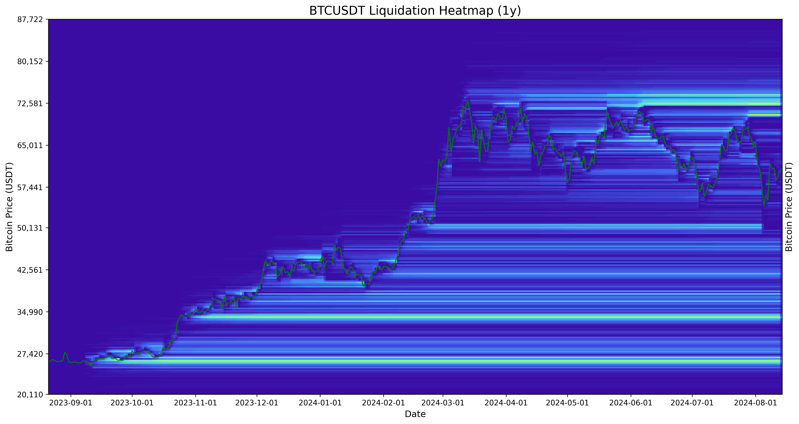

# Coinglass API v3

[](https://www.python.org/downloads/release/python-3100/)

## Unofficial Python client for Coinglass API v3

This project is a fork of the original [Coinglass API wrapper](https://github.com/dineshpinto/coinglass-api) by Dinesh Pinto, updated to support Coinglass API v3.

This wrapper fetches data about crypto derivatives from the [Coinglass API v3](https://coinglass.com/pricing). All data is output in pandas DataFrames (single or multi-index) and all time-series data uses a `DateTimeIndex`. It supports all Coinglass API v3 endpoints.

## Installation

To use this project, follow these steps:

1. Clone the repository:
   ```bash
   git clone https://github.com/ckaraca/coinglass-apiv3.git
   cd coinglass-apiv3
   ```

2. Create a virtual environment:
   ```bash
   python -m venv venv
   source venv/bin/activate  # On Windows use `venv\Scripts\activate`
   ```

3. Install the required packages:
   ```bash
   pip install -r requirements.txt
   ```

4. Set up your Coinglass API key:
   ```bash
   export COINGLASS_API_KEY="YOUR_API_KEY"
   ```
   
   To make this permanent, add the above line to your `.bashrc` or `.bash_profile` file.

5. Run the main script:
   ```bash
   python main.py
   ```

6. Check the generated images in the `images` folder.

## Usage

```python
from coinglass_api.api import CoinglassAPIv3

cg = CoinglassAPIv3(api_key="your_api_key_here")

# General Section
supported_coins = cg.supported_coins()
supported_pairs = cg.supported_exchange_pairs()

# Open Interest Section
ohlc_history = cg.ohlc_history(exchange="Binance", symbol="BTCUSDT", interval="1d", limit=10)
ohlc_agg_history = cg.ohlc_aggregated_history(symbol="BTC", interval="1d", limit=10)
ohlc_agg_stablecoin = cg.ohlc_aggregated_stablecoin_margin_history(exchanges="Binance", symbol="BTC", interval="1d", limit=10)
ohlc_agg_coin = cg.ohlc_aggregated_coin_margin_history(exchanges="Binance", symbol="BTC", interval="1d", limit=10)
exchange_list = cg.exchange_list(symbol="BTC")
exchange_history = cg.exchange_history_chart(symbol="BTC", range="4h", unit="USD")

# Funding Rate Section
funding_rate_ohlc = cg.funding_rate_ohlc_history(exchange="Binance", symbol="BTCUSDT", interval="1d", limit=10)
oi_weight_ohlc = cg.oi_weight_ohlc_history(symbol="BTC", interval="1d", limit=10)
vol_weight_ohlc = cg.vol_weight_ohlc_history(symbol="BTC", interval="1d", limit=10)
funding_rate_exchange_list = cg.funding_rate_exchange_list(symbol="BTC")

# Liquidation Section
liquidation_history = cg.liquidation_history(exchange="Binance", symbol="BTCUSDT", interval="1d", limit=10)
liquidation_agg_history = cg.liquidation_aggregated_history(symbol="BTC", interval="1d", limit=10)
liquidation_coin_list = cg.liquidation_coin_list(ex="Binance")
liquidation_exchange_list = cg.liquidation_exchange_list(symbol="BTC", range="1h")
liquidation_agg_heatmap = cg.liquidation_aggregated_heatmap_model2(symbol="BTC", range="3d")
liquidation_heatmap = cg.liquidation_heatmap_model2(exchange="Binance", symbol="BTCUSDT", range="3d")

# Long Short Account Ratio Section
global_long_short_ratio = cg.global_long_short_account_ratio(exchange="Binance", symbol="BTCUSDT", interval="1h", limit=168)
top_long_short_ratio = cg.top_long_short_account_ratio(exchange="Binance", symbol="BTCUSDT", interval="1h", limit=168)
top_long_short_position_ratio = cg.top_long_short_position_ratio_history(exchange="Binance", symbol="BTCUSDT", interval="1h", limit=168)
```

Each method returns a pandas DataFrame with the requested data. You can further process or analyze this data as needed for your specific use case.

## Example Visualization

Here's an example of a liquidation heatmap generated using this API wrapper:



This heatmap visualizes the liquidation levels for Bitcoin over a one-year period, providing insights into potential price levels where significant liquidations might occur.

## Examples

```python
>>> cg.ohlc_history(exchange="Binance", symbol="BTCUSDT", interval="1d", limit=5).head()
                     t         o         h         l         c         v
time                                                                    
2023-08-10  1691625600  29629.54  29858.00  29501.27  29443.40  25380.02
2023-08-11  1691712000  29443.40  29678.89  29305.89  29416.15  22530.51
2023-08-12  1691798400  29416.14  29483.50  29225.00  29411.82  11009.36
2023-08-13  1691884800  29411.83  29598.70  29330.00  29438.90  13955.23
2023-08-14  1691971200  29438.91  29888.00  29305.49  29794.48  31935.55
```

## Disclaimer

This project is for educational purposes only. You should not construe any such information or other material as legal, tax, investment, financial, or other advice. Nothing contained here constitutes a solicitation, recommendation, endorsement, or offer by me or any third party service provider to buy or sell any securities or other financial instruments in this or in any other jurisdiction in which such solicitation or offer would be unlawful under the securities laws of such jurisdiction.

Under no circumstances will I be held responsible or liable in any way for any claims, damages, losses, expenses, costs, or liabilities whatsoever, including, without limitation, any direct or indirect damages for loss of profits.